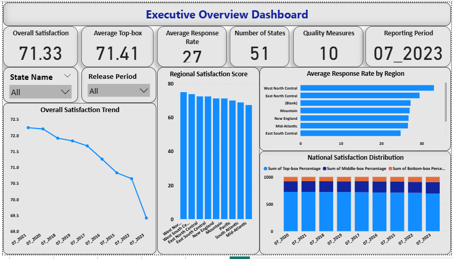

# HCAHPS Patient Experience Analysis

##  Project Overview

This project analyzes **HCAHPS (Hospital Consumer Assessment of Healthcare Providers and Systems)** patient experience data using **Power BI**.

The objective of the project is to evaluate patient satisfaction, compare state and national performance, identify trends in patient experience measures, and transform healthcare survey data into meaningful business insights through interactive dashboards.

---

##  Project Objectives

* Analyze patient experience and satisfaction measures.
* Compare **state-level performance with national benchmarks**.
* Evaluate regional healthcare performance.
* Identify high-performing and low-performing patient experience measures.
* Analyze trends in patient satisfaction.
* Develop meaningful healthcare KPIs.
* Build interactive Power BI dashboards for decision-making.
* Provide business insights and executive recommendations.

---

##  Tools & Technologies

* **Power BI**
* **Power Query**
* **DAX (Data Analysis Expressions)**
* **Data Modeling**
* **CSV datasets**

---

##  Key KPIs

The project includes healthcare performance KPIs such as:

* National Top-box %
* National Middle-box %
* National Bottom-box %
* State Average Top-box %
* State Satisfaction Score
* Regional Satisfaction Score
* Survey Response Rate
* Number of Participating States
* Number of Quality Measures
* Highest Performing Measure
* Lowest Performing Measure
* Year-over-Year Satisfaction Change
* Regional Ranking
* State Ranking

Detailed KPI definitions are available in:

`05_KPI_Document/KPI_Definition_Document.pdf`

---

##  DAX Development

DAX measures were created to support KPI calculations, dynamic analysis, rankings, and dashboard interactions.

The DAX documentation and supporting screenshots are available in:

`07_DAX/`

---

##  Data Modeling

A structured Power BI data model was developed to connect the different HCAHPS datasets and support cross-table analysis.

Data modeling documentation and screenshots are available in:

`11_Data_Modeling/`

---

##  Power BI Dashboards

The Power BI solution contains multiple analytical dashboard pages:

1. **Executive Overview**
2. **State Performance Dashboard**
3. **Patient Experience Measures Dashboard**
4. **National vs State Benchmark Dashboard**
5. **Regional Performance Dashboard**
6. **Trend Analysis Dashboard**

The dashboard also includes KPI cards and interactive analytical features.

### Executive Overview



### State Performance Dashboard


### Patient Experience Measures Dashboard


### National vs State Benchmark Dashboard


### Regional Performance Dashboard


### Trend Analysis Dashboard


---

##  Business Insights

The analysis focuses on:

* Differences in patient experience across states and regions.
* Performance against national healthcare benchmarks.
* Identification of strong and weak patient experience measures.
* Changes in satisfaction performance over time.
* Opportunities for improving patient-centered healthcare services.

Detailed findings are documented in:

`08_Business_Insights/Business_Insights_Report.pdf`

---

##  Executive Recommendations

Based on the analysis, recommendations were developed to help healthcare stakeholders:

* Focus improvement efforts on lower-performing patient experience measures.
* Monitor states and regions performing below national benchmarks.
* Study high-performing regions to identify practices that may be replicated.
* Track satisfaction trends regularly to identify performance changes.
* Use KPI-driven dashboards to support healthcare performance monitoring and decision-making.

Detailed recommendations are available in:

`09_Executive_Report/Executive_Recommendation_Report.pdf`

---

## Repository Structure

```text
HCAHPS-Patient-Experience-Analysis/
│
├── 01_Project_Understanding/
├── 02_BRD/
├── 03_Data_Understanding/
├── 04_Data_Quality/
├── 05_KPI_Document/
├── 06_PowerBI/
│   ├── HCAHPS_Patient_Analysis.pbix
│   └── Screenshots/
├── 07_DAX/
├── 08_Business_Insights/
├── 09_Executive_Report/
├── 10_Presentation/
├── 11_Data_Modeling/
├── Original Data/
└── README.md
```

---

##  Dataset

The repository contains the HCAHPS data tables used for the analysis, including:

* Measures
* National Results
* Questions
* Reports
* Responses
* State Results
* States
* Data Dictionary

These files are available under the `Original Data` folder.

---

##  Project Documentation

The repository contains documentation covering the complete analysis workflow:

* Project Understanding
* Business Requirements
* Dataset Understanding
* Data Quality Assessment
* KPI Definitions
* Power BI Dashboard
* DAX Development
* Business Insights
* Executive Recommendations
* Executive Presentation
* Data Modeling

---

##  Power BI File

The complete Power BI report is available at:

`06_PowerBI/HCAHPS_Patient_Analysis.pbix`

The `.pbix` file can be opened using **Microsoft Power BI Desktop** to explore the data model, DAX measures, visualizations, and interactive dashboard features.

---

##  Author

**Neha Pandey**

Data Analytics Portfolio Project
